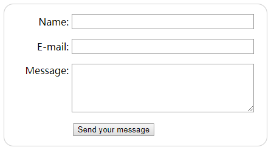

# 创建我的第一个表单

**HTML表单是什么？**

HTML 表单是用户和 web 站点或应用程序之间交互的主要内容之一。它们允许用户将数据发送到 web 站点。大多数情况下，数据被发送到 web 服务器，但是 web 页面也可以自己拦截它并使用它。

HTML 表单是由一个或多个小部件组成的。这些小部件可以是文本字段(单行或多行)、选择框、按钮、复选框或单选按钮。大多数情况下，这些小部件与描述其目的的标签配对， 正确实现的标签能够清楚地指示视力正常的用户和盲人用户输入表单所需的内容。


HTML 表单和常规 HTML 文档的主要区别在于，大多数情况下，表单收集的数据被发送到 web 服务器。在这种情况下，您需要设置一个 web 服务器来接收和处理数据。

## 设计表单

在开始编写代码之前，花点时间考虑一下您的表单。设计一个快速的模型将帮助您定义您想要询问用户的正确的数据集。

从用户体验（UX）的角度来看，要记住：表单越大，失去用户的风险就越大。保持简单，保持专注:只要求必要的数据。

我们将构建一个简单的联系人表单，让我们做一个粗略的草图：


我们的表单将包含三个文本字段和一个按钮。我们向用户询问他们的姓名、电子邮件和他们想要发送的信息。点击这个按钮将把他们的数据发送到一个web服务器。

## 实现我们的表单


```
<form action="/my-handling-form-page" method="post">
    <div>
        <label for="name">Name:</label>
        <input type="text" id="name" name="user_name" />
    </div>
    <div>
        <label for="mail">E-mail:</label>
        <input type="email" id="mail" name="user_email" />
    </div>
    <div>
        <label for="msg">Message:</label>
        <textarea id="msg" name="user_message"></textarea>
    </div>
    <div class="button">
        <button type="submit">Send your message</button>
    </div>
</form>
```

为了构建我们的联系人表单，我们使用了以下 HTML 元素:

- `<form>` 元素
    - 表示了文档中的一个区域，这个区域包含有交互控制元件，用来向web服务器提交信息。 
- `<label>` 元素
    - 表示用户界面中项目的标题
- `<input>` 元素
    - 用于为基于Web的表单创建交互式控件，以便接受来自用户的数据。
- `<textarea>` 元素
    - 表示一个多行纯文本编辑控件。
- `<button>` 元素
    - 表示一个可点击的按钮，可以用在表单或文档其它需要使用简单标准按钮的地方。

### `<form>` 元素

所有 HTML 表单都以一个 `<form>` 元素开始。


```
<form action="/my-handling-form-page" method="post">

</form>
```

这个元素正式定义了一个表单。就像 `<div>` 元素或 `<p>` 元素，它是一个容器元素，但它也支持一些特定的属性来配置表单的行为方式。

它的所有属性都是可选的，但至少要设置 `action` 属性和 `method` 属性，这被认为是最佳实践。

- `action` 属性 定义了在提交表单时，应该把所收集的数据送给谁（/模块）（URL）去处理。
-  `method` 属性 定义了发送数据的 HTTP 方法（它可以是 “get” 或 “post” ）

### `<label>`、`<input>`、`<textarea>` 元素

```
<div>
    <label for="name">Name:</label>
    <input type="text" id="name">
</div>
<div>
...
<div>
    <label for="msg">Message:</label>
    <textarea id="msg"></textarea>
</div>

```

使用 `<div>` 元素可以使我们更加方便地构造我们自己的代码，并且更容易样式化。

在所有 `<label>` 元素上使用 `for` 属性，它是将标签链接到表单小部件的一种正规方式。这个属性引用对应的小部件的 `id`。这样做的好处：允许用户单击标签以激活相应的小部件。

在 `<input>` 元素中，最重要的属性是 `type` 属性，因为它定义了 `<input>` 属性的行为方式。

#### `<input>` 和 `<textarea></textarea>` 的语法区别：

-  `<input>` 是一个空元素，它不需要关闭标签。
-  `<textarea>` 不是一个空元素，因此必须使用适当的结束标记来关闭它。

这对 HTML 表单的特定特性有影响：定义默认值的方式。

如果您要定义 `<input>` 的默认值，你必须使用 `value` 属性。如下所示：

```
<input type="text" value="by default this element is filled with this text" />
```

相反，如果您想定义 `<textarea>` 的默认值，您只需在 `<textarea>` 元素的开始和结束标记之间放置默认值，就像这样：

```
<textarea>by default this element is filled with this text</textarea>
```


### `<button>` 元素

使用 `<button>` 元素 让用户在填写完表单后发送他们的数据。在 `</form>` 这个结束标签上方添加以下内容：

```
<div class="button">
  <button type="submit">Send your message</button>
</div>
```

`<button>` 元素 的 `type` 属性 接受三个值中的一个:

- `submit`
    - 单击 `type` 属性定义为 `submit` 按钮：发送表单的数据到 `<form>`元素的 `action` 属性所定义的网页。
- `reset`
    - 单击 `type` 属性定义为 `reset` 按钮：将所有表单小部件重新设置为它们的默认值。从用户体验的角度来看，这被认为是一种糟糕的做法。
- `button`
    - 单击 `type` 属性定义为 `button` 按钮：不会发生任何事！这听起来很傻，但是用 JavaScript 构建定制按钮非常有用。 

您还可以使用相应类型的  `<input>` 元素来生成一个按钮，如：

```
<input type="submit">
```

`<button>` 元素的主要优点是： `<input>`元素只允许纯文本作为其标签，而 `<button>` 元素允许完整的 HTML 内容，允许更复杂、更有创意的按钮文本。

## 基本表单样式

在 HTML 头部中添加一个 `<style>` 元素，并添加一些 css 代码：

```
form {
  /* 居中表单 */
  margin: 0 auto;
  width: 400px;
  /* 显示表单的轮廓 */
  padding: 1em;
  border: 1px solid #CCC;
  border-radius: 1em;
}

form div + div {
  margin-top: 1em;
}

label {
  /* 确保所有label大小相同并正确对齐 */
  display: inline-block;
  width: 90px;
  text-align: right;
}

input, textarea {
  /* 确保所有文本输入框字体相同
     textarea默认是等宽字体 */
  font: 1em sans-serif;

  /* 使所有文本输入框大小相同 */
  width: 300px;
  box-sizing: border-box;

  /* 调整文本输入框的边框样式 */
  border: 1px solid #999;
}

input:focus, textarea:focus {
  /* 给激活的元素一点高亮效果 */
  border-color: #000;
}

textarea {
  /* 使多行文本输入框和它们的label正确对齐 */
  vertical-align: top;

  /* 给文本留下足够的空间 */
  height: 5em;
}

.button {
  /* 把按钮放到和文本输入框一样的位置 */
  padding-left: 90px; /* 和label的大小一样 */
}

button {
  /* 这个外边距的大小与label和文本输入框之间的间距差不多 */
  margin-left: .5em;
}
```

|| 运行结果 ||




## 向 web 服务器发送表单数据

`<form>` 元素将定义如何通过 `action` 属性和 `method` 属性来发送数据的位置和方式。

但这还不够。我们还需要为我们的数据提供一个名称。这些名称对双方都很重要：在浏览器端，它告诉浏览器给数据各来自哪个名称，在服务器端，它允许服务器按名称处理每个数据块。

要将数据命名为表单，您需要在每个表单小部件上使用 `name` 属性来收集特定的数据块。

```
<form action="/my-handling-form-page" method="post"> 
  <div>
    <label for="name">Name:</label>
    <input type="text" id="name" name="user_name">
  </div>
  <div>
    <label for="mail">E-mail:</label>
    <input type="email" id="mail" name="user_email">
  </div>
  <div>
    <label for="msg">Message:</label>
    <textarea id="msg" name="user_message"></textarea>
  </div>
  ...
</form>
```

**在客户端**，表单会发送三个已命名的数据块 "`user_name`"， "`user_email`"，和 "`user_message`"。这些数据将用使用 HTTP POST 方法，把信息发送到 URL 为 "`/my-handling-form-page`" 目录下。

**在服务器端**，位于 URL"/`my-handling-form-page`" 上的脚本将接收的数据作为 HTTP 请求中包含的 3 个键/值项的列表。这个脚本处理这些数据的方式取决于您。每个服务器端语言（C、Java、Node、Python、PHP、Ruby 等等）都有自己的数据处理机制。

# 如何构造 HTML 表单

## `<form>` 元素

`<form>` 元素按照一定的格式定义了表单和确定表单行为的属性。当您想要创建一个 HTML 表单时，都必须从这个元素开始，然后把所有内容都放在里面。许多辅助技术或浏览器插件可以发现 `<form>` 元素并实现特殊的钩子，使它们更易于使用。 

**【Warn】**

> 严格禁止在一个表单内嵌套另一个表单。嵌套会使表单的行为不可预知，而这取决于正在使用的浏览器。

> 在 `<form>` 元素之外使用表单小部件也是可以的，但是如果您这样做了，那么表单小部件与任何表单都没有任何关系。

## `<fieldset>` 和 `<legend>` 元素

`<fieldset>` 元素是一种方便的用于创建具有相同目的的小部件组的方式，出于样式和语义目的。你可以在 `<fieldset>` 开口标签后加上一个 `<legend>` 元素来给 `<fieldset>` 标上标签。 `<legend>` 的文本内容正式地描述 `<fieldset>` 的用途。它是包含在 `<fieldset>` 里的。

```
<form>
  <fieldset>
    <legend>Fruit juice size</legend>
    <p>
      <input type="radio" name="size" id="size_1" value="small">
      <label for="size_1">Small</label>
    </p>
    <p>
      <input type="radio" name="size" id="size_2" value="medium">
      <label for="size_2">Medium</label>
    </p>
    <p>
      <input type="radio" name="size" id="size_3" value="large">
      <label for="size_3">Large</label>
    </p>
  </fieldset>
</form>
```

|| 运行结果 ||


**【Tips】**

> 当阅读上述表格时，屏幕阅读器将会读第一个小部件 “Fruit juice size small”，“Fruit juice size medium” 为第二个，“Fruit juice size large” 为第三个。


**`<fieldset>` 和 `<legend>` 元素 的意义**

- 每当您有一组单选按钮时，您应该将它们嵌套在 `<fieldset>` 元素中。
- 一般来说，`<fieldset>` 元素也可以用来对表单进行分段。理想情况下，长表单应该在多个页面之间进行拆分，但是如果表单很长，但必须在单个页面上，那么在不同的 fieldsets 中放置不同的相关部分可以提高可用性。

## `<label>` 元素

`<label>` 元素是为 HTML 表单小部件定义标签的正式方法。如果你想构建可访问的表单，这是最重要的元素。当实现的恰当时，屏幕阅读器会连同有关的说明和表单元素的标签一起朗读。

```
<label for="name">Name:</label>
<input type="text" id="name" name="user_name">
```

`<label>` 标签与 `<input>` 通过他们各自的 `for` 属性和 `id` 属性正确相关联。这样，屏幕阅读器会读出诸如 “Name, edit text” 之类的东西。

一个小部件可以嵌套在它的 `<label>` 元素中：

```
<label for="name">
    Name: <input type="text" id="name" name="user_name">
</label>
```

尽管可以这样做，但人们认为设置 `for` 属性才是最好的做法，因为一些辅助技术不理解标签和小部件之间的隐式关系。

## 标签也可点击！

正确设置标签的另一个好处是可以在所有浏览器中单击标签来激活相应的小部件。

这对于像文本输入这样的例子很有用，这样你可以通过点击标签，和点击输入区效果一样，来聚焦于它，这对于单选按钮和复选框尤其有用 —— 这种控件的可点击区域可能非常小，设置标签来使它们可点击区域变大是非常有用的。

```
<form>
  <p>
    <label for="taste_1">I like cherry</label>
    <input type="checkbox" id="taste_1" name="taste_cherry" value="1">
  </p>
  <p>
    <label for="taste_2">I like banana</label>
    <input type="checkbox" id="taste_2" name="taste_banana" value="2">
  </p>
</form>
```

|| 运行结果 ||


## 一个小部件上放置多个标签（too bad!）

您可以在一个小部件上放置多个标签，但是这不是一个好主意，因为一些辅助技术可能难以处理它们。

在多个标签的情况下，您应该将一个小部件和它的标签嵌套在一个 `<label>` 元素中。

```
<p>Required fields are followed by <abbr title="required">*</abbr>.</p>

<!-- So this: -->
<div>
  <label for="username">Name:</label>
  <input type="text" name="username">
  <label for="username"><abbr title="required">*</abbr></label>
</div>

<!-- would be better done like this: -->
<div>
  <label for="username">
    <span>Name:</span>
    <input id="username" type="text" name="username">
    <abbr title="required">*</abbr>
  </label>
</div>

<!-- But this is probably best: -->
<div>
  <label for="username">Name: <abbr title="required">*</abbr></label>
  <input id="username" type="text" name="username">
</div>
```
|| 运行结果 ||


顶部的段落定义了所需元素的规则。它必须在开始时确保像屏幕阅读器这样的辅助技术在用户找到必需的元素之前显示或念出它们。这样，他们就知道星号表达的是什么意思了。根据屏幕阅读器的设置，屏幕阅读器会把星号读为“star”或“required”，取决于屏幕阅读器的设置。

1. 在第一个例子中，标签根本没有和 `input` 一起被念出来：读出来的只是 “edit the blank”，和单独被念出的标签。多个 `<label>` 元素会使屏幕阅读器迷惑。
2. 在第二个例子中，事情变得清晰一点了：标签和输入一起，读出的是 “name star name edit text”，但标签仍然是单独读出的。这还是有点令人困惑，但这次还是稍微好一点了，因为 `input` 和 `label` 联系起来了。
3. 第三个例子是最好的：标签是一起读出的，标签和输入读出的是 “name star edit text”。

## 用于表单的通用 HTML 结构

用 `<div>` 元素包装标签和它的小部件是很常见的做法。`<p>` 元素也经常被使用，HTML 列表也是如此。

除了 `<fieldset>` 元素之外，使用 HTML 标题（例如，`<h1>`、`<h2>`）和分段（如`<section>`）来构造一个复杂的表单也是一种常见的做法。

> 最重要的是，你要找到一种你觉得很舒服的风格去码代码，而且它也能带来可访问的、可用的形式。

### 构建一个表单结构

```
<form>
<h1>Payment form</h1>
<p>Required fields are followed by <strong><abbr title="required">*</abbr></strong>.</p>

<section>
    <h2>Contact information</h2>
    <fieldset>
      <legend>Title</legend>
      <ul>
          <li>
            <label for="title_1">
              <input type="radio" id="title_1" name="title" value="M." >
              Mister
            </label>
          </li>
          <li>
            <label for="title_2">
              <input type="radio" id="title_2" name="title" value="Ms.">
              Miss
            </label>
          </li>
      </ul>
    </fieldset>
    <p>
      <label for="name">
        <span>Name: </span>
        <strong><abbr title="required">*</abbr></strong>
      </label>
      <input type="text" id="name" name="username">
    </p>
    <p>
      <label for="mail">
        <span>E-mail: </span>
        <strong><abbr title="required">*</abbr></strong>
      </label>
      <input type="email" id="mail" name="usermail">
    </p>
    <p>
      <label for="pwd">
        <span>Password: </span>
        <strong><abbr title="required">*</abbr></strong>
      </label>
      <input type="password" id="pwd" name="password">
    </p>
</section>

<section>
    <h2>Payment information</h2>
    <p>
      <label for="card">
        <span>Card type:</span>
      </label>
      <select id="card" name="usercard">
        <option value="visa">Visa</option>
        <option value="mc">Mastercard</option>
        <option value="amex">American Express</option>
      </select>
    </p>
    <p>
      <label for="number">
        <span>Card number:</span>
        <strong><abbr title="required">*</abbr></strong>
      </label>
        <input type="text" id="number" name="cardnumber">
    </p>
    <p>
      <label for="date">
        <span>Expiration date:</span>
        <strong><abbr title="required">*</abbr></strong>
        <em>formatted as mm/yy</em>
      </label>
      <input type="date" id="date" name="expiration">
    </p>
</section>

<p> <button type="submit">Validate the payment</button> </p>
</form>
```

|| 运行结果 ||


---

**附：**

- MDN Web Doc：
    - [创建我的第一个表单](https://developer.mozilla.org/zh-CN/docs/Learn/HTML/Forms/Your_first_HTML_form)
    - [如何构造 HTML 表单](https://developer.mozilla.org/zh-CN/docs/Learn/HTML/Forms/How_to_structure_an_HTML_form)
- Code：
    - first-forms.html
    - fieldset-legend.html
    - checkbox-label.html
    - required-labels.html
    - payment-form.html