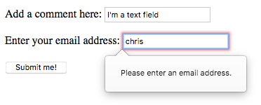

# 基础原生表单部件

## 原生表单部件通用属性

- **`autofocus`**
    - 默认值：`false`
    - 描述：这个布尔属性允许您指定当页面加载时元素应该自动具有输入焦点，除非用户覆盖它，例如通过键入不同的控件。文档中只有一个与表单相关的元素可以指定这个属性。
- **`disabled`**
    - 默认值：`false`
    - 描述：这个布尔属性表示用户不能与元素交互。如果没有指定这个属性，元素将从包含的元素继承它的设置，例如 `<fieldset>`，如果没有包含 `disabled` 属性集的元素，那么就启用了元素。
- **`form`**
    - 默认值：
    - 描述：小部件与之相关联的表单元素。属性值必需是同个文档中的 `<form>` 属性的 `id` 属性。理论上，它允许您在 `<form>` 元素之外设置一个表单小部件。然而，在实践中，没有任何支持该特性的浏览器。
- **`name`**
    - 默认值：
    - 描述：元素的名称;这是用于表单数据提交的。
- **`value`**
    - 默认值：
    - 描述：元素的初始值。

## 文本输入框

文本输入框 `<input>` 是最基本的表单小部件。 这是一种非常方便的方式，可以让用户输入任何类型的数据。但是，一些文本字段可以专门用于满足特定的需求。

所有文本框都有一些通用规范：

- `readonly` 属性：用户不能修改输入值。
- `disabled` 属性：输入值永远不会与表单数据的其余部分一起发送。
- `placeholder` 属性：文本输入框中出现的文本，用来简略描述输入框的目的。
- `size` 属性：框的物理尺寸 和 长度 (可以输入的最大字符数)。
- 拼写检查。

### 文本框
`type = "text"`

```
<input type="text" id="comment" name="comment" value="Please input your comments">
```

**【Tips】**

> 单行文本框只有一个真正的约束：如果您输入带有换行符的文本，浏览器会在发送数据之前删除这些换行符。

### E-mail 地址框

`type="email"`

```
input type="email" id="email" name="email" multiple>
```

用户需要在框中输入有效的电子邮件地址，任何其他内容都会导致浏览器在提交表单时显示错误。注意，这是客户端错误验证，由浏览器执行。



通过包括 `multiple` 属性，它还可以让用户将多个电子邮件地址输入相同的输入（以逗号分隔）。

### 密码框

`type="password"`

```
<input type="password" id="pwd" name="pwd">
```

### 搜索框

`type="search"`

```
<input type="search" id="search" name="search">
```

文本框和搜索框之间的主要区别是浏览器的样式。通常，搜索框是渲染成圆角的，并且可能给定一个 “x” 来清除输入的值。

搜索框的另外一个值得注意的特性：它们的值可以被自动保存用来在同一站点上的多个页面上自动补全。

### 电话号码栏

`type="tel"`

```
<input type="tel" id="tel" name="tel">
```

由于世界范围内各种各样的电话号码格式，这种类型的字段不会对用户输入的值执行任何限制（包括字母，等等）。这主要是在语义上的区分。

在一些设备上（特别是在移动设备上），可能会出现一个不同的虚拟键盘，更适合输入电话号码。

### URL 栏

`type="url"`

```
<input type="url" id="url" name="url">
```

它为字段添加了特殊的验证约束，如果输入无效的 url，浏览器就会报告错误。

### 多行文本域

上面的 文本框、E-mail 地址框、密码框、搜索框、电话号码栏、URL 栏 都属于单行文本框。可见`<input>` 元素是十分特别，因为它几乎可以是任何东西。

通过简单设置 `type` 属性，它可以彻底的改变，它用于创建大多数类型的表单小部件，包括单行文本字段、没有文本输入的控件、时间和日期控件和按钮。

多行文本域专指使用 `<textarea>` 元素，而不是使用 `<input>` 元素。

```
<textarea cols="30" rows="10"></textarea>
```

**`<textarea>` 元素属性**

属性名 | 默认值 | 描述
---|---|---
`cols` | `20` |文本控件的可见宽度，平均字符宽度。
`rows` |    |控制的可见文本行数。
`wrap` | `soft` |表示控件是如何包装文本的。可能的值：`hard` 或 `soft`

#### `<input>` 和 `<textarea>` 区别

- `<input>` 元素 是一个空元素，它不能包含任何子元素；
- `<textarea>` 元素 是一个常规元素，可以包含文本内容的子元素。


- `<input>` 元素 定义一个默认值，必须使用 `value` 属性；
- `<textarea>` 元素，将默认的文本放在起始标记和 `<textarea>` 的结束标记之间。


- `<input>` 元素 通过设置 `type` 属性，成为不同的部件，接受不同类型的东西；
- `<textarea>` 元素 只接受文本内容。将任何 HTML 内容放入 `<textarea>` 中都呈现为纯文本内容。


- `<input>` 元素 在输入带有换行符的文本时，浏览器会在发送数据之前删除这些换行符；
- `<textarea>` 元素 允许用户输入包含硬换行符（即按回车）的文本。


- 多行文本域 在右下角还有一个拖放操作，允许用户调整它的大小。这种调整能力可以通过使用 CSS 设置文本区域的 `resize` 性质为 `none` 来关闭。

## 下拉内容

下拉窗口小部件是一种简单的方法，可以让用户选择众多选项中的一个，而不需要占用用户界面的太多空间。

HTML 有两种类型的下拉内容: **select box** 和 **autocomplete box**。这两种类型的交互都是相同的：一旦控件被激活，浏览器就会显示用户可以选择的值列表。

### 选择框

一个选择框是用 `<select>` 元素创建的，其中有一个或多个 `<option>` 元素作为子元素，每个元素都指定了其中一个可能的值。

```
<select id="simple" name="simple">
  <option>Banana</option>
  <option>Cherry</option>
  <option>Lemon</option>
</select>
```

如果需要，可以使用 `selected` 属性在所需的 `<option>` 元素上设置选择框的默认值，这样在页面加载时会默认选择该选项。

`<option>` 元素也可以嵌套在 `<optgroup>`元素中，以创建视觉关联的组值。


```
<select id="groups" name="groups">
  <optgroup label="fruits">
    <option>Banana</option>
    <option selected>Cherry</option>
    <option>Lemon</option>
  </optgroup>
  <optgroup label="vegetables">
    <option>Carrot</option>
    <option>Eggplant</option>
    <option>Potato</option>
  </optgroup>
</select>
```

**【Tips】**

- 如果一个 `<option>` 元素设置了 `value` 属性，那么当提交表单时该属性的值就会被发送。如果忽略了 `value` 属性，则使用 `<option>` 元素的内容作为选择框的值。
- 在 `<optgroup>` 元素中，`label` 属性显示在值之前，但即使它看起来有点像一个选项，它也不是可选的。

### 多选选择框

默认情况下，选择框只允许用户选择一个值。但是如果您将 `multiple` 属性添加到 `<select>`元素，那么将允许用户通过操作系统提供的默认机制来选择几个值。 (如， 同时按下 **`Cmd`**/**`Ctrl`** 并点击多个值)

在多个选项选择框的情况下，选择框不再显示值为下拉内容，而是它们都显示在一个列表中。

```
<select multiple id="multi" name="multi">
  <option>Banana</option>
  <option>Cherry</option>
  <option>Lemon</option>
</select>
```

### 自动补全输入框

您可以使用 `<datalist>` 元素来为表单小部件提供建议的、自动完成的值，并使用一些 `<option>` 子元素来指定要显示的值。

然后使用 `list`属性将数据列表绑定到一个文本域（通常是一个 `<input>` 元素）。

一旦数据列表与表单小部件相关联，它的选项用于自动完成用户输入的文本。通常，这是作为一个下拉框向用户展示的，在输入框中输入可能匹配的内容。

```
<label for="myFruit">What's your favorite fruit?</label>
<input type="text" name="myFruit" id="myFruit" list="mySuggestion">
<datalist id="mySuggestion">
  <option>Apple</option>
  <option>Banana</option>
  <option>Blackberry</option>
  <option>Blueberry</option>
  <option>Lemon</option>
  <option>Lychee</option>
  <option>Peach</option>
  <option>Pear</option>
</datalist>
```

**【Warn】**

> 根据 HTML 规范，`list` 属性和 `<datalist>` 元素可以用于任何需要用户输入的小部件。然而，它应该如何与文本以外的控件（例如颜色或日期）一起工作还不清楚，不同的浏览器在不同的情况下表现也不同。因此，除了文本字段外，请谨慎使用此功能。

#### `<datalist>` 元素浏览器的支持问题

为了处理浏览器的不支持（如 IE 10 以下不支持），这里有一个小技巧，可以为这些浏览器提供一个不错的备用。

```
<label for="myFruit">What is your favorite fruit? (With fallback)</label>
<input type="text" id="myFruit" name="fruit" list="fruitList">
    
<datalist id="fruitList">
  <label for="suggestion">or pick a fruit</label>
  <select id="suggestion" name="altFruit">
    <option>Apple</option>
    <option>Banana</option>
    <option>Blackberry</option>
    <option>Blueberry</option>
    <option>Lemon</option>
    <option>Lychee</option>
    <option>Peach</option>
    <option>Pear</option>
  </select>
</datalist>
```

- 支持 `<datalist>` 元素的浏览器将忽略所有不是 `<option>` 元素的元素，并按照预期工作。
- 另一方面，不支持 `<datalist>`元素的浏览器将显示标签和选择框。

除此方法外，还可以使用 JavaScript 处理浏览器对 `<datalist>` 元素 的支持问题

## 可选中项

可选中项是状态可以通过单击它们来更改小部件。

有两种可选中项：复选框和单选按钮。两者都使用 `checked` 属性，以指示该部件的默认状态: "选中"或"未选中"。

值得注意的是，这些小部件与其他表单小部件不一样：
- 对于大多数表单部件，一旦表单提交，所有具有 `name` 属性的小部件都会被发送，即使没有任何值被填。
- 对于可选中项，只有在勾选时才发送它们的值。如果他们没有被勾选，就不会发送任何东西，甚至连他们的名字也没有。

**【Tips】**

- 为了获得最大的可用性和可访问性，建议在 `<fieldset>` 中包围每个相关项目的列表，并使用 `<legend>` 提供对列表的全面描述。
- 每个单独的 `<label>`/`<input>` 元素都应该包含在它自己的列表项中。
- 您还需要为这些类型的输入提供 `value` 属性，如果您想让它们具有意义 —— 如果没有提供任何值，则复选框和单选按钮被赋予一个 `on` 值。


## 复选框

`type="checkbox"`

```
<input type="checkbox" checked id="carrots" name="carrots" value="carrots">
```

## 单选按钮

`type="radio"`

```
<input type="radio" checked id="soup" name="meal">
```

几个单选按钮可以连接在一起。如果它们的 `name` 属性共享相同的值，那么它们将被认为属于同一组的按钮。同一组中只有一个按钮可以同时被选。

```
<fieldset>
  <legend>What is your favorite meal?</legend>
  <ul>
    <li>
      <label for="soup">Soup</label>
      <input type="radio" checked id="soup" name="meal" value="soup">
    </li>
    <li>
      <label for="curry">Curry</label>
      <input type="radio" id="curry" name="meal" value="curry">
    </li>
    <li>
      <label for="pizza">Pizza</label>
      <input type="radio" id="pizza" name="meal" value="pizza">
    </li>
  </ul>
</fieldset>
```

## 按钮

使用 <button>元素或者<input>元素来创建一个按钮。type属性的值指定显示什么类型的按钮。

在 HTML 表单中，有三种按钮：
- **Submit**
- **Reset**
- **Button** （Anonymous，匿名的）

### Submit

将表单数据发送到服务器。

```
<button type="submit">
    This a <br><strong>submit button</strong>
</button>

<input type="submit" value="This is a submit button">
```

### Reset

将所有表单小部件重新设置为它们的默认值。

```
<button type="reset">
    This a <br><strong>reset button</strong>
</button>

<input type="reset" value="This is a reset button">
```
### Button

没有自动生效的按钮，但是可以使用 JavaScript 代码进行定制。如果您省略了 `type` 属性，那么这就是默认值。

```
<button type="button">
    This an <br><strong>anonymous button</strong>
</button>

<input type="button" value="This is an anonymous button">
```

不管您使用的是 `<button>` 元素还是 `<input>` 元素，按钮的行为都是一样的。但是，有一些显著的不同之处：

- `<button>` 元素允许您在它们的标签中使用 HTML 内容，这些内容被插入到打开和关闭 `<button>` 标签中。
- `<input>` 元素是空元素; 它们的标签被插入到 `value` 属性中，因此只接受纯文本内容。


- `<button>` 元素中，标签可以是 HTML，因此可以相应地进行样式化。
- `<input>` 元素中，标签只能是字符数据。


- 使用 `<button>` 元素，可以有一个不同于按钮标签的值（通过设置 `value` 中的属性值）。

# 高级原生表单部件

## 数字

`type="number"`

这个控件看起来像一个文本框，但是只允许浮点数，并且通常提供一些按钮来增加或减少小部件的值。

也可以：
- 通过设置 `min` 和 `max` 属性来约束该值。
- 通过设置 `step` 属性来指定增加和减少按钮更改小部件的步进值大小。

*Example*

```
<input type="number" name="age" id="age" min="1" max="10" step="2">
```

这将创建一个数字小部件，其值被限制为 1 到 10 之间的任何值，而其增加和减少按钮的步进值将更改为2。

> IE 10 以下的版本不支持 `number` 输入。

## 滑块

`type="range"`

另一种选择数字的方法是使用滑块。从视觉上讲，滑块没有文本字段准确，因此它们被用来选择一个确切值并不重要的数字。

```
<input type="range" name="beans" id="beans" min="0" max="500" step="10">
```

创建了一个滑块，它可能的值在 0 到 500 之间，而它的递增/递减按钮以 +10 和 -10 来改变值。

**【Warn】**

滑块的一个问题是，它们不提供任何形式的视觉反馈，以了解当前的值是什么。

您需要使用 JavaScript 来添加这一点，但这相对来说比较容易。在本例中，我们添加了一个空的 `<span>`元素，其中我们将写入滑块的当前值，并在更改时更新它。

```
<label for="beans">How many beans can you eat?</label>
<input type="range" name="beans" id="beans" min="0" max="500" step="10">
<span class="beancount"></span>
```

```
var beans = document.querySelector('#beans');
var count = document.querySelector('.beancount');

count.textContent = beans.value;

beans.oninput = function() {
  count.textContent = beans.value;
}
```

## 日期时间选择器

### 本地时间

`type="datetime-local"`

创建一个小部件来显示和选择一个日期，但是没有任何特定的时区信息。

```
<input type="datetime-local" name="datetime" id="datetime">
```

### 月

`type="month"`

创建了一个小部件来显示和挑选一个月。

```
<input type="month" name="month" id="month">
```

#### 时间

`type="time"`

创建一个小部件来显示并选择一个时间值。

```
<input type="time" name="time" id="time">
```

#### 星期

`type="week"`

创建一个小部件来显示并挑选一个星期号和它的年份。

```
<input type="week" name="week" id="week">
```

所有日期和时间控制都可以使用 `min` 和 `max` 属性来约束。

```
<label for="myDate">When are you available this summer?</label>
<input type="date" name="myDate" min="2018-06-01" max="2018-08-31" id="myDate">
```

> 日期和时间窗口小部件仍然很不受支持：Chrome、Edge 和 Opera 都支持它们，但 IE、Firefox 和 Safari 不支持。

## 拾色器

颜色总是有点难处理。它们有很多方式来表达：RGB 值(十进制或十六进制)、HSL 值、关键字等等。

颜色小部件允许用户在文本和可视的方式中选择颜色。

`type="color"`

```
<input type="color" name="color" id="color">
```

> 注：拾色器 IE 中不支持，Safari 目前也不支持。

# 其他原生小部件

## 文件选择器

`type="file"`

创建一个文件选择器小部件

- 使用 `<input>` 元素，将它的 `type` 属性设置为 `file`。
- 使用 `accept` 属性来约束被接受的文件类型。
- 通过添加 `multiple`属性可以让用户选择多个文件。

```
<input type="file" name="file" id="file" accept="image/*" multiple>
```

## 隐藏内容

`type="hidden"`

有时候，由于技术原因，有些数据是用表单发送的，但不显示给用户，这有时是很方便的。要做到这一点，您可以在表单中添加一个不可见的元素。

如果您创建了这样一个元素，就需要设置它的 `name` 和 `value` 属性：

```
<input type="hidden" id="timestamp" name="timestamp" value="1286705410">
```

## 图像按钮

图像按钮控件是一个与 `` 元素完全相同的元素，除了当用户点击它时，它的行为就像一个提交按钮。

```
<input type="image" alt="Click me!" src="my-img.png" width="80" height="30" />
```

如果使用图像按钮来提交表单，这个小部件不会提交它的值。

相反，提交的是在图像上单击处的 X 和 Y 坐标（坐标是相对于图像的，这意味着图像的左上角表示坐标 (0, 0)），坐标被发送为两个键/值对：

- X 值键是 `name` 属性的值，后面是字符串 “.x”。
- Y 值键是 `name` 属性的值，后面是字符串 “.y”。

例如，当您点击这个小部件的图像时，您将被发送到一个 URL，如下所显示的

```
http://foo.com?pos.x=123&pos.y=456
```

这是构建 “热图” 的一种非常方便的方式。

如何发送和检索这些值？ 参见：[发送和检索表单数据](https://developer.mozilla.org/en-US/docs/Learn/HTML/Forms/Sending_and_retrieving_form_data)

## 进度条

一个进度条表示一个值，它会随着时间的变化而变化到最大的值，这个值由 `max` 属性指定。这样的一个 bar 是使用 `<progress>` 元素创建的。

```
<progress max="100" value="75">75/100</progress>
```

这是为了实现任何需要进度报告的内容，例如下载的总文件的百分比，或者问卷中填写的问题的数量。

`<progress>` 元素中的内容用于不支持该元素的浏览器的回退，以及辅助技术对其朗读。

## 仪表

一个仪表表示一个固定值，这个值由一个 `min` 和一个 `max` 值所定。这个值是作为一个条形显示的，并且为了知道这个工具条是什么样子的，我们将这个值与其他一些设置值进行比较：

- `low` 和 `high` 值范围划分为三个部分：
    - 该范围的较低部分是在 `min` 和 `low` 值（包括那些值）之间。
    - 该范围的中间部分是在 `low` 和 `high` 值之间（不包括那些值）。
    - 该范围的较高部分是在 `high` 和 `max`值（包括那些值）之间。

- `optimum` 值定义了 `<meter>` 元素的最优值。在与 htmlattrxref("low"、"meter") 和 `high` 值的联合中，它定义了该范围的哪个部分是优先的：
    - 如果 `optimum` 值在较低的范围内，则较低的范围被认为是首选项，中等范围被认为是平均值，而较高的范围被认为是最坏的部分。
    - 如果 `optimum` 值在该范围的中等部分，则较低的范围被认为是一个平均值，中等范围被认为是优先的部分，而较高的范围也被认为是平均值。
    - 如果 `optimum`值在较高的范围内，则较低的范围被认为是最坏的部分，中等范围被认为是一般的部分，较高的范围被认为是优先的部分。


- 所有实现 `<meter>`元素的浏览器都使用这些值来改变米尺的颜色。
    - 如果当前值位于该范围的优先部分，则该条是绿色的。
    - 如果当前值位于该范围的平均部分，则该条是黄色的。
    - 如果当前值处于最糟糕的范围，则该条是红色的。

这样的一个工具栏是使用 `<meter>` 元素创建的。这是用于实现任何类型的仪表，例如一个显示磁盘上使用的总空间的条，当它开始满时，它会变成红色。

```
<meter min="0" max="100" value="75" low="33" high="66" optimum="50">75</meter>
```

`<meter>` 元素中的内容是不支持该元素的浏览器的回退，以及辅助技术对其发出的声音。

---

**附：**

- MDN Web Doc：
    - [原生表单部件](https://developer.mozilla.org/zh-CN/docs/Learn/HTML/Forms/The_native_form_widgets)
- Code：
    - 
	