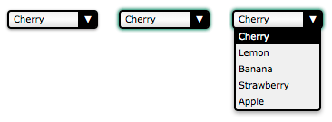

**Q**：为什么要构建自己的表单小部件？

在许多情况下，可用的 HTML 表单小部件是不够的。如果要在某些小部件（例如 HTML 的 `<select>` 元素）上执行高级样式，或者如果要提供自定义行为，则别无选择，只能构建自己的小部件。

本文中，主要学习如何重建 `<select>` 元素。

# 设计, 结构, 和语义
在构建一个自定义控件之前，首先你要确切的知道你要什么。 这将为您节省宝贵的时间。 特别地，清楚地定义控件的所有状态非常重要。

为了做到这一点，从状态和行为表现都众所周知的现有小控件开始是很好的选择，你也可以尽可能多的模仿这些控件。

例如：<select>元素 控件的三个主要状态：
- 正常状态（左）
- 活动状态（中）
- 打开状态（右）



**以下情况控件将会呈现正常状态：**
- 页面加载
- 控件处于活动状态，但用户点击控件以外的任何位置
- 控件是活动状态，但用户使用键盘将焦点移动到另一个小部件

**以下情况控件将会呈现活动状态：**
- 用户点击
- 用户按下 tab 让控件重新获得焦点。
- 控件呈现打开状态然后用户点击控件。

**以下情况控件的值将会被改变:**
- 控件在打开状态下用户点击一个选项
- 控件在打开状态下用户按下键盘上方向键或者下方向键

最后，让我们定义控件的选项将要怎么表现：

- 当控件在打开状态时，选项将被突出显示
- 当鼠标悬停在某个选项上时，该选项将被突出显示，并且之前突出显示的选项将返回正常的状态

如果你在定义时有疑问，请征询他人的意见，如果你有预算，请不要犹豫的去进行 [用户可行性测试](https://en.wikipedia.org/wiki/Usability_testing)，这个过程被称为 UX design （User Experience Design，用户体验设计）。更多知识参见：
- [UXMatters.com](http://www.uxmatters.com/)
- [UXDesign.com](http://uxdesign.com/)
- [The UX Design section of SmashingMagazine](http://uxdesign.smashingmagazine.com/)

## 定义语义化的 HTML 结构
现在控件的基本功能已经决定了，可以开始构建自定义控件了。

**Step 1**：
确定 HTML 结构并给予一些基本的语义规则。

重构 `<select>` 元素：

```
<!-- 这是我们小部件的主要容器.
     tabindex属性是用来让用户聚焦在小部件上的. 
     稍后我们会发现最好通过JavaScript来设定它的值. -->
<div class="select" tabindex="0">
  
  <!-- 这个容器用来显示组件现在的值 -->
  <span class="value">Cherry</span>
  
  <!-- 这个容器包含我们的组件的所有可用选项.
       因为他是一个列表，用ul元素是有意义的. -->
  <ul class="optList">
    <!-- 每个选项只包含用来显示的值，
         稍后我们会知道如何处理和表单一起发送的真实值 -->
    <li class="option">Cherry</li>
    <li class="option">Lemon</li>
    <li class="option">Banana</li>
    <li class="option">Strawberry</li>
    <li class="option">Apple</li>
  </ul>

</div>
```

**注意类名的使用：**
> 不管实际使用了哪种底层 HTML 元素，它们都标识每个相关的部分。

> 这很重要，因为这样做能确保我们的 CSS 和 JavaScript 不会和 HTML 结构强绑定，这样我们就可以在不破坏使用小部件的代码的情况下进行实现更改。

> 比如，如果你希望增加一个等价的<optgroup>元素。


## 使用 CSS 创建外观

构建自定义控件的重点是能够完全按照我们的期望设置它的样式。

为了达到这个目的，我们将 CSS 部分的工作分为两部分：
1. 第一部分 是让我们的控件表现得像一个 `<select>` 元素所必需的的 CSS 规则；
2. 第二部分 包含了让组件看起来像我们所希望那样的精妙样式。

### 所需的样式

- 用以处理我们组件的三种状态的必须样式：

```
.select {
  /* 这将为选项列表创建一个上下文定位 */
  position: relative;
 
  /* 这将使我们的组件成为文本流的一部分，同时又可以调整大小 */
  display : inline-block;
}
```

- 使用类 `active` 来定义组件处于其激活状态时的的界面外观。
- 通过 `:focus` 伪类重复自定义样式来确保它们表现得一样。

```
.select .active,
.select:focus {
  outline: none;
 
  /* 这里的 box-shadow 属性并非必须，但确保活动状态能看出来，
  我们将其作为一个默认值，你可以随意地覆盖掉它. */
  box-shadow: 0 0 3px 1px #227755;
}
```

- 处理选项列表

```
/* 这里的 .select 选择器是一个糖衣语法，用来确保我们定义的类是
   在我们的组件里的那个。 */
.select .optList {
  /* 这可以确保我们的选项列表将会显示在值的下面，
  并且会处在 HTML 流之外*/
  position : absolute;
  top      : 100%;
  left     : 0;
}
```

- 为了管理没有完全匹配的活动状态和打开状态之间的差异，我们需要一个额外的类来处理选项列表隐藏时的情况：

```
.select .optList.hidden {
  /* 这是一个以可访问形式隐藏列表的简单方法, 
     对可访问性我们将在最后进一步拓展 */
  max-height: 0;
  visibility: hidden;
}
```

### 美化

现在我们的基本功能已经就位，有趣的事情就可以开始了。下面是一个可行的简单的例子，和本文开头的截图是相对应的。

```
.select {
  /* 出于可访问性方面的原因，所有尺寸都会由em值表示
     (用来确保用户在文本模式下使用浏览器缩放时组件的可缩放性). 
     在大多数浏览器下的默认换算是1em == 16px.
     如果你对em和px的转换感到疑惑, 请参考http://riddle.pl/emcalc/ */
  font-size   : 0.625em; /* 这个（=10px）是以em方式表达的这个环境里的字体大小 */
  font-family : Verdana, Arial, sans-serif;

  -moz-box-sizing : border-box;
  box-sizing : border-box;

  /* 我们需要为将要添加的向下箭头准备一些额外的空间 */
  padding : .1em 2.5em .2em .5em; /* 1px 25px 2px 5px */
  width   : 10em; /* 100px */

  border        : .2em solid #000; /* 2px */
  border-radius : .4em; /* 4px */
  box-shadow    : 0 .1em .2em rgba(0,0,0,.45); /* 0 1px 2px */
  
  /* 第一段声明是为了不支持线性梯度填充的浏览器准备的。
     第二段声明是因为基于WebKit的浏览器没有预先定义它。
     如果你想为过时的浏览器提供支持, 请参阅 http://www.colorzilla.com/gradient-editor/ */
  background : #F0F0F0;
  background : -webkit-linear-gradient(90deg, #E3E3E3, #fcfcfc 50%, #f0f0f0);
  background : linear-gradient(0deg, #E3E3E3, #fcfcfc 50%, #f0f0f0);
}

.select .value {
  /* 因为值的宽度可能超过组件的宽度，我们需要确保他不会改变组件的宽度 */
  display  : inline-block;
  width    : 100%;
  overflow : hidden;

  vertical-align: top;

  /* 如果内容溢出了, 最好有一个恰当的缩写. */
  white-space  : nowrap;
  text-overflow: ellipsis;
}
```

我们不需要一个额外的元素来设计向下的箭头，而使用 `:after` 伪类来替代。然而，这也可以通过使用一张加在 `select class` 上的简单的背景图像来实现。

```
.select:after {
  content : "▼"; /* 我们使用了unicode 编码的字符 U+25BC; 参阅 http://www.utf8-chartable.de */
  position: absolute;
  z-index : 1; /* 这对于防止箭头覆盖选项列表很重要 */
  top     : 0;
  right   : 0;

  -moz-box-sizing : border-box;
  box-sizing : border-box;

  height  : 100%;
  width   : 2em;  /* 20px */
  padding-top : .1em; /* 1px */

  border-left  : .2em solid #000; /* 2px */
  border-radius: 0 .1em .1em 0;  /* 0 1px 1px 0 */

  background-color : #000;
  color : #FFF;
  text-align : center;
}
```

接下来，让我们定义选项列表的样式。

```
.select .optList {
  z-index : 2; /* 我们明确的表示选项列表会始终与向下箭头重叠 */

  /* 这会重置ul元素的默认样式 */
  list-style: none;
  margin : 0;
  padding: 0;

  -moz-box-sizing : border-box;
  box-sizing : border-box;

  /* 这会确保即使数值比组件小，选项列表仍能变得跟组件自身一样大*/
  min-width : 100%;

  /* 万一列表太长了, 它的内容会从垂直方向溢出(会自动添加一个竖向滚动条) 
     但是水平方向不会(因为我们没有设定宽度, 列表会自适应宽度. 如果不能的话，内容会被截断) */
  max-height: 10em; /* 100px */
  overflow-y: auto;
  overflow-x: hidden;

  border: .2em solid #000; /* 2px */
  border-top-width : .1em; /* 1px */
  border-radius: 0 0 .4em .4em; /* 0 0 4px 4px */

  box-shadow: 0 .2em .4em rgba(0,0,0,.4); /* 0 2px 4px */
  background: #f0f0f0;
}
```

对于选项，我们需要添加一个 `highlight` 类以便能标明用户将要选择的值或者已经选择的值。

```
.select .option {
  padding: .2em .3em; /* 2px 3px */
}

.select .highlight {
  background: #000;
  color: #FFFFFF;
}
```

这是三种状态的结果：


# 通过JavaScript让小部件生动起来

现在我们的设计和结构已经完成了。我们可以写些 JavaScript 代码来让这个部件真正生效。

### JavaScript为什么不生效？
很多情况下，JavaScript
不能在浏览器中运行。

- 用户关掉了 JavaScript：这是最不常见的情形。现在只有很少的人会关掉 JavaScript。
- 脚本没有加载。这是最常见的情形，特别是在移动端上，在那些网络非常不可靠的地方。
- 脚本是有问题的。你应该总是考虑这种可能性。
- 脚本和第三方脚本冲突。这可能会由用户使用的跟踪脚本和一些书签工具引发。
- 脚本与一个浏览器的拓展冲突，或者受其影响。 (比如 Firefox 的 [NoScript](https://addons.mozilla.org/fr/firefox/addon/noscript/) 拓展 或者 Chrome 的 [NotScripts](https://chrome.google.com/webstore/detail/notscripts/odjhifogjcknibkahlpidmdajjpkkcfn) 拓展)。
- 用户在使用老旧的浏览器，而且你需要的一些功能没有被支持。当你使用一些最新的 API 时，这种情况会经常发生。

因为这些风险，认真考虑 JavaScript 不生效时会发生什么是很重要的。

在我们的例子中，如果 JavaScript 代码没有运行，我们会回退到显示一个标准的 `<select>` 元素。为了实现这一点，我们需要两样东西。

首先，在每次使用我们的自定义部件前，我们需要添加一个标准的 <select> 元素。实际上，为了能将来自我们自定义的表单组件和以及其他部分的表单数据发送出去，这个元素也是需要的。

```
<body class="no-widget">
  <form>
    <select name="myFruit">
      <option>Cherry</option>
      <option>Lemon</option>
      <option>Banana</option>
      <option>Strawberry</option>
      <option>Apple</option>
    </select>

    <div class="select">
      <span class="value">Cherry</span>
      <ul class="optList hidden">
        <li class="option">Cherry</li>
        <li class="option">Lemon</li>
        <li class="option">Banana</li>
        <li class="option">Strawberry</li>
        <li class="option">Apple</li>
      </ul>
    </div>
  </form>

</body>
```


第二，我们需要两个新的 classes 来隐藏不需要的元素。(那就是，当我们的脚本没有运行时显示的“真正的” `<select>` 元素, 而如果脚本正常运行就会显示自定义组件)。注意默认情况下，我们的 HTML 代码会隐藏我们的自定义组件。

```
.widget select,
.no-widget .select {
  /* 这个CSS选择器大体上说的是：
     - 要么我们将body的class设置为"widget"，隐藏真实的<select>元素
     - 或是我们没有改变body的class,这样body的class还是"no-widget",
       因此class为"select"的元素需要被隐藏 */
  position : absolute;
  left     : -5000em;
  height   : 0;
  overflow : hidden;
}
```


接下来我们需要一个 JavaScript 开关来确定脚本是否运行。这个开关非常简单：如果页面加载时，我们的脚本运行了，它将会移除 `no-widget` class ，并添加 `widget` class，由此切换 `<select>` 元素和自定义组件的可视性。

```
window.addEventListener("load", function () {
  document.body.classList.remove("no-widget");
  document.body.classList.add("widget");
});
```


> 注意: 如果你真的想让你的代码变得通用和可重用，最好不要做一个 class 选择器开关，而是通过添加一个组件 class 的方式来隐藏 `<select>` 元素，并且动态地在每一个 `<select>` 元素后面添加 DOM 树表示来表示页面中的自定义组件。

### [让工作变得更简单](https://developer.mozilla.org/zh-CN/docs/Learn/HTML/Forms/How_to_build_custom_form_widgets#让工作变得更简单)

### 构造事件回调

基础已经准备好了，我们现在可以开始定义所有会在用户每次同我们的组件交互时用到的函数了。

```
// 这个函数会用在每当我们想要停用一个自定义组件的时候
// 它需要一个参数：
// select :要停用的带有 'select' 类的节点
function deactivateSelect(select) {

  // 如果组件没有运行，不用进行任何操作
  if (!select.classList.contains('active')) return;

  // 我们需要获取自定义组件的选项列表
  var optList = select.querySelector('.optList');

  // 关闭选项列表
  optList.classList.add('hidden');

  // 然后停用组件本身
  select.classList.remove('active');
}

// 每当用户想要激活（或停用）这个组件的时候，会调用这个函数
// 它需要2个参数：
// select : 要激活的带有'select'类的DOM节点
// selectList : 包含所有带'select'类的DOM节点的列表
function activeSelect(select, selectList) {

  // 如果组件已经激活了，不进行任何操作
  if (select.classList.contains('active')) return;

  // 我们需要关闭所有自定义组件的活动状态
  // 因为deactiveselect函数满足forEach回调函数的所有请求，
  // 我们直接使用它，不使用中间匿名函数
  selectList.forEach(deactivateSelect);

  // 然后我们激活特定的组件
  select.classList.add('active');
}

// 每当用户想要打开/关闭选项列表的时候，会调用这个函数
// 它需要一个参数:
// select : 要触发的列表的DOM节点
function toggleOptList(select) {

  // 该列表不包含在组件中
  var optList = select.querySelector('.optList');

  // 我们改变列表的class去显示/隐藏它
  optList.classList.toggle('hidden');
}

// 每当我们要高亮一个选项的时候，会调用该函数
// 它需要两个参数:
// select : 带有'select'类的DOM节点，包含了需要高亮强调的选项
// option : 需要高亮强调的带有'option'类的DOM节点
function highlightOption(select, option) {

  // 为我们的自定义select元素获取所有有效选项的列表
  var optionList = select.querySelectorAll('.option');

  // 我们移除所有选项的高亮强调
  optionList.forEach(function (other) {
    other.classList.remove('highlight');
  });

  // 我们高亮强调正确的选项
  option.classList.add('highlight');
};
```
这是你需要用来处理组件不同状态的所有代码。

接下来，我们将这些函数绑定到合适的事件上：

```
// 我们处理文档加载时的事件绑定。
window.addEventListener('load', function () {
  var selectList = document.querySelectorAll('.select');

  // 每个自定义组件都需要初始化
  selectList.forEach(function (select) {

    // 它的'option'元素也需要
    var optionList = select.querySelectorAll('.option');

    // 每当用户的鼠标悬停在一个选项上时，我们高亮这个指定的选项
    optionList.forEach(function (option) {
      option.addEventListener('mouseover', function () {
        // 注意:'select'和'option'变量是我们函数调用范围内有效的闭包 。
        highlightOption(select, option);
      });
    });

    // 每当用户点击一个自定义的select元素时
    select.addEventListener('click', function (event) {
      // 注意:'select'变量是我们函数调用范围内有效的闭包。 

      // 我们改变选项列表的可见性
      toggleOptList(select);
    });

    // 如果组件获得了焦点
    // 每当用户点击它或是用tab键访问这个组件时，组件获得焦点
    select.addEventListener('focus', function (event) {
      // 注意:'select'和'selectlist'变量是我们函数调用范围内有效的闭包 。

      // 我们激活这个组件
      activeSelect(select, selectList);
    });

    // 如果组件失去焦点
    select.addEventListener('blur', function (event) {
      // 注意:'select'变量是我们函数调用范围内有效的闭包。

      // 我们关闭这个组件
      deactivateSelect(select);
    });
  });
});
```

此时，我们的组件会根据我们的设计改变状态，但是它的值仍然没有更新。

### 处理组件的值

既然我们的组件已经开始工作了，我们必须添加代码，使其能够根据用户的输入更新取值，并且能将取值随表单数据一同发送。

实现这一点最简单的方法是使用后台原生组件。这样的一个组件会使用浏览器提供的所有内置控件跟踪值，并且在表单提交时，取值也会像往常一样发送。当有现成的功能时，我们再做重复工作就毫无意义了。

像前面所看到的那样，出于可访问性的原因，我们已经使用了一个原生的选择组件作为后备显示内容；我们可轻松的将它的值与我们的自定义组件之间的值同步。

```
// 这个函数更新显示的值并将其通过原生组件同步
// 它需要2个参数:
// select : 含有要更新的值的'select'类的DOM节点
// index  : 要被选择的值的索引
function updateValue(select, index) {
  // 我们需要为了给定的自定义组件获取原生组件
  // 在我们的例子中, 原生组件是自定义组件的‘同胞’
  var nativeWidget = select.previousElementSibling;

  // 我们也需要得到自定义组件的值占位符，
  var value = select.querySelector('.value');

  // 还有整个选项列表。
  var optionList = select.querySelectorAll('.option');

  // 我们将被选择的索引设定为我们的选择的索引
  nativeWidget.selectedIndex = index;

  // 更新相应的值占位符
  value.innerHTML = optionList[index].innerHTML;

  // 然后高亮我们自定义组件里对应的选项
  highlightOption(select, optionList[index]);
};

// 这个函数返回原生组件里当前选定的索引
// 它需要1个参数:
// select : 跟原生组件有关的'select'类DOM节点
function getIndex(select) {
  // 我们需要为了给定的自定义组件访问原生组件
  // 在我们的例子中, 原生组件是自定义组件的一个“同胞”
  var nativeWidget = select.previousElementSibling;

  return nativeWidget.selectedIndex;
};
```

通过这两个函数，我们可以将原生组件绑定到自定义的组件上。

```
// 我们在文档加载时处理事件的绑定。
window.addEventListener('load', function () {
  var selectList = document.querySelectorAll('.select');

  // 每个自定义组件都需要初始化
  selectList.forEach(function (select) {
    var optionList = select.querySelectorAll('.option'),
        selectedIndex = getIndex(select);

    // 使我们的自定义组件可以获得焦点
    select.tabIndex = 0;

    // 我们让原生组件无法获得焦点
    select.previousElementSibling.tabIndex = -1;

    // 确保默认选中的值正确显示
    updateValue(select, selectedIndex);

    // 每当用户点击一个选项的时候，更新相应的值
    optionList.forEach(function (option, index) {
      option.addEventListener('click', function (event) {
        updateValue(select, index);
      });
    });

    // 每当用户在获得焦点的组件上用键盘操作时，更新相应的值
    select.addEventListener('keyup', function (event) {
      var length = optionList.length,
          index  = getIndex(select);

      // 当用户点击向下箭头时，跳转到下一个选项
      if (event.keyCode === 40 && index < length - 1) { index++; }

      // 当用户点击向上箭头时，跳转到上一个选项
      if (event.keyCode === 38 && index > 0) { index--; }

      updateValue(select, index);
    });
  });
});
```

在上面的代码里，值得注意的是 `tabIndex` 属性的使用。使用这个属性是很有必要的，这可以确保原生组件将永远不会获得焦点，而且还可以确保当用户用户使用键盘和鼠标时，我们的自定义组件能够获得焦点。

做完上面这些后，我们就完成了！

# 使其具有可访问性

我们构建了一个能够生效的东西，尽管这离一个特性齐全的选择框还差得远，但是它效果不错。但是我们已经完成的事情只不过是摆弄 DOM。这个组件并没有真正的语义，即使它看起来像一个选择框，但是从浏览器的角度来看并不是，所以辅助技术并不能明白这是一个选择框。简单来说，这个全新的选择框并不具备可访问性！

幸运的是，有一种解决方案叫做 [ARIA](https://developer.mozilla.org/en-US/docs/Accessibility/ARIA)。ARIA代表“无障碍富互联网应用”。这是一个专为我们现在做的事情设计的 [W3C 规范](http://www.w3.org/TR/wai-aria/)：使网络应用和自定义组件易于访问，它本质上是一组用来拓展 HTML 的属性集，以便我们能够更好的描述角色，状态和属性，就像我们刚才设计的元素是是它试图传递的原生元素一样。使用这些属性非常简单，所以让我们来试试看。

## `role` 属性

ARIA 使用的关键属性是 `role` 属性。`role` 属性接受一个值，该值定义了一个元素的用途。每一个 `role` 定义了它自己的需求和行为。在我们的例子中，我们会使用 `listbox` 这一 role。这是一个 “合成角色”，表示具有该 role 的元素应该有子元素，每个子元素都有特定的角色。（在这个案例中，至少有一个具有 `option` 角色的子元素）。

同样值得注意的是，ARIA 定义了默认应用于标准 HTML 标记的角色。例如，`<table>` 元素与角色 `grid` 相匹配，而 `<ul>` 元素与角色 `list` 相匹配。由于我们使用了一个 `<ul>` 元素，我们想要确保我们组件的 `listbox` 角色能替代 `<ul>` 元素的 `list` 角色。为此，我们会使用角色 `presentation`。这个角色被设计成让我们来表示一个元素没有特殊的含义，并且仅仅用于提供信息。我们会将其应用到 `<ul>` 元素上。

为了支持 `listbox `角色，我们只需要将我们 HTML 改成这样：

```
<!-- 我们把role="listbox" 属性添加到我们的顶部元素 -->
<div class="select" role="listbox">
  <span class="value">Cherry</span>
  <!-- 我们也把 role="presentation" 添加到ul元素中 -->
  <ul class="optList" role="presentation">
    <!-- 然后把role="option" 属性添加到所有li元素里 -->
    <li role="option" class="option">Cherry</li>
    <li role="option" class="option">Lemon</li>
    <li role="option" class="option">Banana</li>
    <li role="option" class="option">Strawberry</li>
    <li role="option" class="option">Apple</li>
  </ul>
</div>
```

> 只有当你想要为不支持 CSS 属性选择器的旧浏览器提供支持时，才有必要同时包含 `role` 属性和一个 `class` 属性。


## `aria-selected` 属性

仅仅使用 `role` 属性是不够的。 ARIA 还提供了许多状态和属性的内部特征。你能更好更充分的利用它们，你的组件就会能够被辅助技术更好的理解。在我们的例子中，我们会把使用限制在一个属性上：`aria-selected`。

`aria-selected` 属性被用来标记当前被选中的选项；这可以让辅助技术告知用户当前的选项是什么。我们会通过 JavaScript 动态地使用该属性，每当用户选择一个选项时标记选中的选项。为了达到这一目的，我们需要修正我们的 `updateValue()` 函数


```
function updateValue(select, index) {
  var nativeWidget = select.previousElementSibling;
  var value = select.querySelector('.value');
  var optionList = select.querySelectorAll('.option');

  // 我们确保所有的选项都没有被选中
  optionList.forEach(function (other) {
    other.setAttribute('aria-selected', 'false');
  });

  // 我们确保选定的选项被选中了
  optionList[index].setAttribute('aria-selected', 'true');

  nativeWidget.selectedIndex = index;
  value.innerHTML = optionList[index].innerHTML;
  highlightOption(select, optionList[index]);
};
```

---

**附：**

- MDN Web Doc：
    - [如何构建表单小工具](https://developer.mozilla.org/zh-CN/docs/Learn/HTML/Forms/How_to_build_custom_form_widgets)
    - [jQuery UI](http://jqueryui.com/)
    - [msDropDown](https://github.com/marghoobsuleman/ms-Dropdown)
    - [Nice Forms](http://www.emblematiq.com/lab/niceforms/)
    - [And many more…](https://www.google.fr/search?q=HTML+custom+form+controls&ie=utf-8&oe=utf-8&aq=t&rls=org.mozilla:fr:official&client=firefox-a)
- Code：
    - build-select-widgets.html