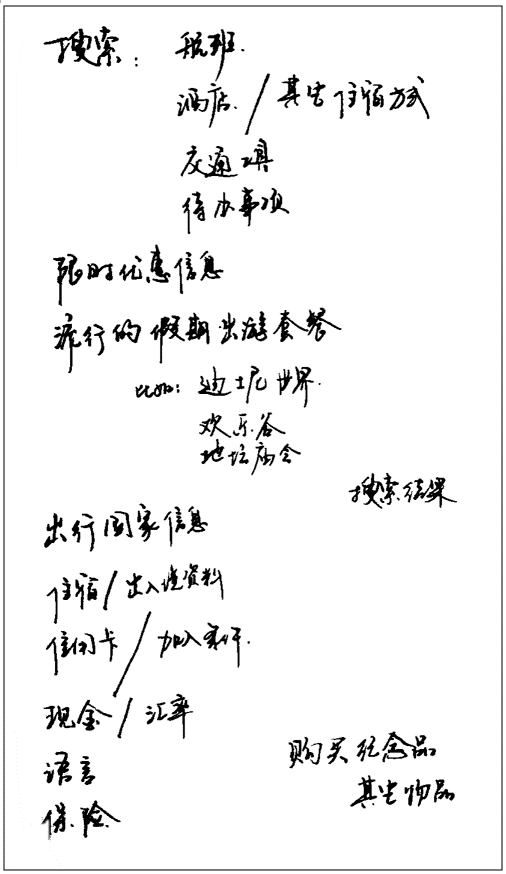
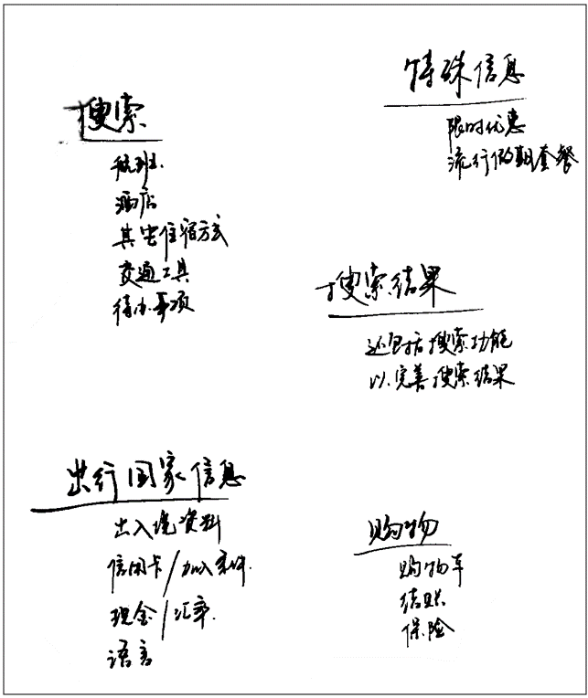
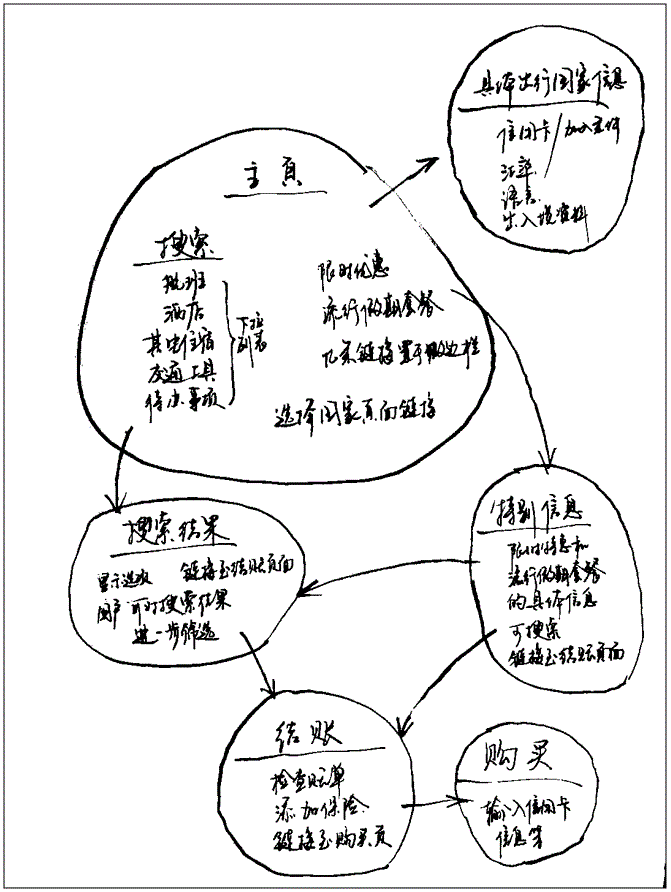

# 文档的基本部分

网页的外观多种多样，但是除了全屏视频或游戏，或艺术作品页面，或只是结构不当的页面以外，都倾向于使用类似的标准组件：

**页眉（标题栏）**

通常横跨于整个页面顶部有一个大标题 和/或 一个标志。 这是网站的主要一般信息，通常存在于所有网页。

**导航栏**

链接到网站的主要部分；通常由菜单按钮、链接或选项卡表示。类似于标题栏，导航栏通常应在所有网页之间保持一致，否则会让用户感到疑惑，甚至无所适从。

**主内容**

中心的一个大区域，包含给定网页的大部分独特内容，例如视频、文章、地图、新闻等。这是网站的一部分，绝对会因页面而异。

**侧边栏**

一些次要信息、链接、引言、广告等。通常这是与主要内容中包含的内容相关（例如在新闻文章页面上，侧边栏可能包含作者的个人信息或相关文章的链接），还可能存在其他的重复元素，如辅助导航系统。

**页脚**

横跨页面底部的狭长区域。和标题一样，页脚是放置公共信息（比如版权声明或联系方式）的，一般使用较小字体，且通常为次要内容。 还可以通过提供快速访问链接来进行 SEO。

# 用于结构化网站的HTML
为了实现这样的语义标记，HTML提供了可以用来表示这些部分的专用标签。

- `<header>`：页眉
- `<nav>`：导航栏
- `<main>`：主内容。 具有代表性的内容段落主题可以使用 `<article>`, `<section>`, 和 `<div>` 元素。
- `<aside>`：侧栏。经常嵌套在 `<main>` 中。
- `<footer>`：页脚

*site-structure.html*

```
<!DOCTYPE html>
<html>
  <head>
    <meta charset="utf-8">
    <title>二次元俱乐部</title>
    <link href="https://fonts.googleapis.com/css?family=Open+Sans+Condensed:300|Sonsie+One" rel="stylesheet">
    <link href="https://fonts.googleapis.com/css?family=ZCOOL+KuaiLe" rel="stylesheet">
    <link href="style.css" rel="stylesheet">
  </head>

  <body>
    <header> <!-- 本站所有网页的统一主标题 -->
      <h1>聆听电子天籁之音</h1>
    </header>
    
    <nav> <!-- 本站统一的导航栏 -->
      <ul>
        <li><a href="#">主页</a></li>
        <!-- 共n个导航栏项目，省略…… -->
      </ul>

      <form> <!-- 搜索栏是站点内导航的一个非线性的方式。 -->
        <input type="search" name="q" placeholder="要搜索的内容">
        <input type="submit" value="搜索">
      </form>
    </nav>
    
    <main> <!-- 网页主体内容 -->
      <article>
        <!-- 此处包含一个 article（一篇文章），内容略…… -->
      </article>
      
      <aside> <!-- 侧边栏在主内容右侧 -->
        <h2>相关链接</h2>
        <ul>
          <li><a href="#">这是一个超链接</a></li>
          <!-- 侧边栏有n个超链接，略略略…… -->
        </ul>
      </aside>
    </main>
    
    <footer> <!-- 本站所有网页的统一页脚 -->
      <p>© 2050 某某保留所有权利</p>
    </footer>
  </body>
</html>
```
|| 运行结果 ||


# HTML布局元素详解

### `<header>`
展现了一系列的介绍性内容。如果它是 `<body>`  的子元素,它就定义了网站的全局页眉。但是如果它是  `<article>` 或 `<section>` 的子元素，它就定义了这些部分的特定的页眉（不要把这些与 `<title>` 混淆）。

### `<nav>`
包含了页面主要的导航功能。其中不应包含二级链接等内容。

### `<main>` 
存放每个页面独有的内容。每个页面上只能用一次 `<main>`，且直接位于 `<body>` 中。最好不要把它嵌套进其它元素。

### `<article>`
包围的内容即一篇文章，与页面其它部分无关（比如一篇博文）。

### `<section>`

与 `<article>` 类似，但 `<section>` 更适用于组织页面使其按功能（比如迷你地图、一组文章标题和摘要）分块。一般的最佳用法是：
- 以 标题 作为开头；
- 也可以把一篇 `<article>` 分成若干部分并分别置于不同的 `<section>` 中；
- 也可以把一个区段 `<section>` 分成若干部分并分别置于不同的 `<article>` 中、

这些要取决于上下文。

### `<aside>`
包含一些间接信息（术语条目、作者简介、相关链接，等等）。

### `<footer>`
包含了页面的页脚部分。


## 无语义元素

有时你会发现，对于一些要组织的项目或要包装的内容，现有的语义元素均不能很好对应。

有时候你可能只想将一组元素作为一个单独的实体来修饰来响应单一的用 CSS 或 JavaScript。为了应对这种情况，HTML提供了 `<div>` 和 `<span>` 元素。

应配合使用 `class` 属性提供一些标签，使这些元素能易于查询。

### `<div>`
是一个块级无语义元素，应仅用于找不到更好的块级元素时，或者不想增加特定的意义时。

### `<span>`
是一个内联的（inline）无语义元素，最好只用于无法找到更好的语义元素来包含内容时，或者不想增加特定的含义时。

> `<div>` 非常便利但容易被滥用。由于它们没有语义值，会使 HTML 代码变得混乱。要小心使用，只有在没有更好的语义方案时才选择它，而且要尽可能少用， 否则文档的升级和维护工作会非常困难。

## 换行与水平分割线
#### `<br>`
  在一个段落中创建一个换行。

#### `<hr>`
在文档中生成一条水平分割线，表示文本中主题的变化（例如主题或场景的变化）。看起来就是一条水平线。

# 设计一个简单的网站
1. 把页面中相同的重复的内容记录下来。（如：导航菜单、页脚等）


2. 通过画一个草图来说明每个页面的结构样子。


3. 跟网站设计人员一起讨论，还希望网站上显示哪些内容，以列表的形式写下来。



4. 尝试把这些内容进行分组，这样可以让你了解哪些内容可以放在一个相同的页面上。



5. 尝试着再画一个网站的草图 — 每个气泡代表网站的一个页面，在气泡与气泡之间用连线的方式，来说明它们之间的联系。主页面可能位于中心位置，并且链接到其他的大多数页面。




---

**附：**

- MDN Web Doc：
    - [文档与网站架构](https://developer.mozilla.org/zh-CN/docs/learn/HTML/Introduction_to_HTML/%E6%96%87%E4%BB%B6%E5%92%8C%E7%BD%91%E7%AB%99%E7%BB%93%E6%9E%84)
- Code：
    - site-structure.html
	